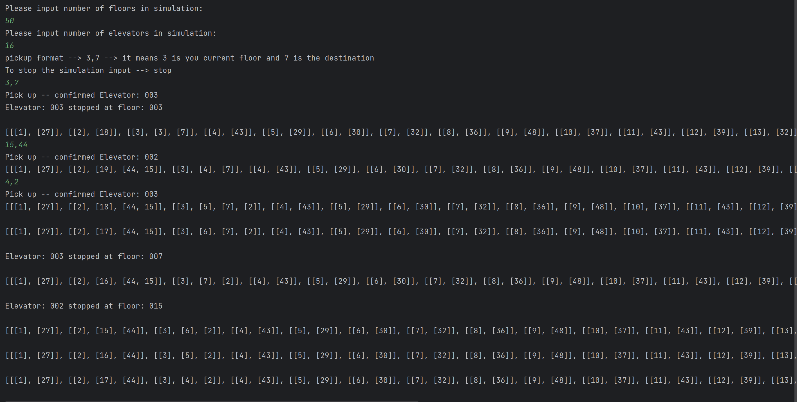

# ElevatorSystem
Simple Elevator System

## Table of Contents
* [Description](#description)
* [Screenshots](#screenshots)
* [Setup](#setup)
* [Simulation Manual](#simulation-manual)

## Description

Simple elevator control system with simulation to show how it works. Algorithm chosen to run the elevators is not FCFS, because it would be very inefficient. So the algorithm takes the pickup request consisting of current floor and destination floor as ArrayList of 2 elements [destination,current] and adds it to Request ArrayList. Every time elevator goes to next floor, it checks if there is a floor at the last index of a List in his request ArrayList equal to elevator's current floor. If this happens at least once, the doors of the elevator will stop at this floor and every element at the last index will be removed of this (at first) two-element List. If List contained only one element (destination floor) this whole List is also removed from Request List. The algorithm prevents the situation, where the elevator would stop at the destination floor without picking people up from their current floor earlier. Moreover, because of this the elevator will stop every time there is somebody to drop or pick up at the floor making it much more efficient than FCFS.

## Screenshots

## Setup

Simulation can be started, by running Main class.

## Simulation Manual

To see algorithm in action I created a simple simulation of the elevator system.

Simulation simplifications:

- Step of the simulation is moving all the elevators (that have requests) by exactly one floor
- All elevators move with the same speed in any direction
- Time of closing and opening the doors is ignored
- There can be only one pickup request per step
- Simulation will go the next step only after user interaction (you are running and controlling the flow of it)
- Simulation starts with elevators on random floors and without any request (you need to create a request to make it moving)

At the beginning of the simulation you will be asked to pass basic parameters of the Elevator System (both are integers > 0):
1. Number of floors in the building
2. Number of elevators in the building

After setting these parameters, the simulation will start. As the user you have 3 options of input:
1. '' --> Simply pressing ENTER will pass empty line and the simulation will go the next step
2. 'current_floor,destination_floor' --> these input (both values must be integers) will create pick up request. Example --> '3,7'
3. 'stop' --> Passing these will stop the simulation (by finishing the process with exit code 0)
